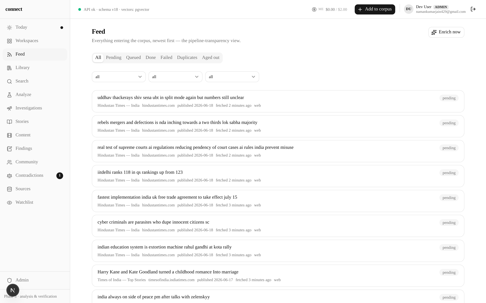
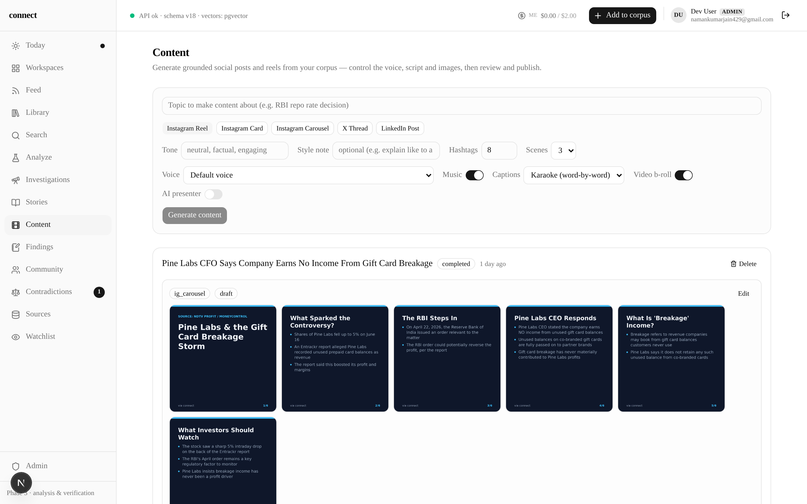
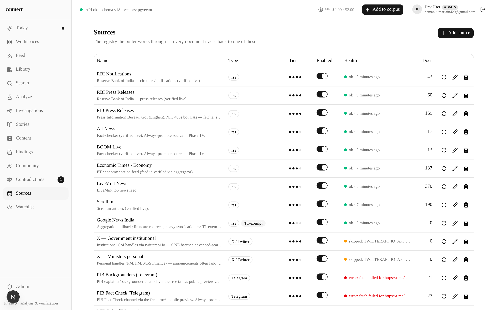
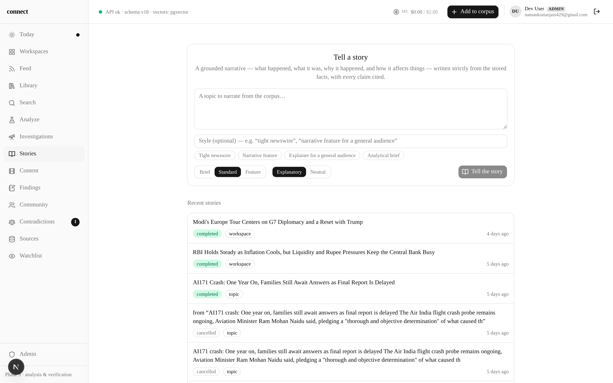
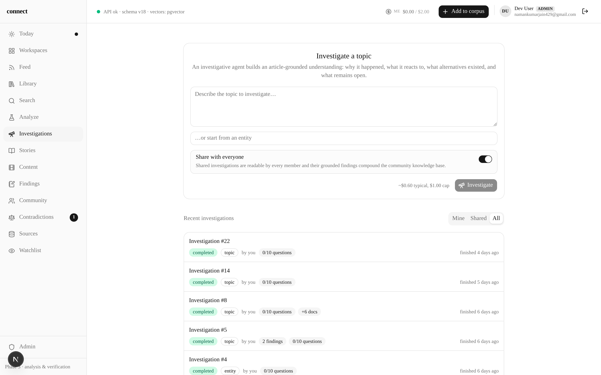
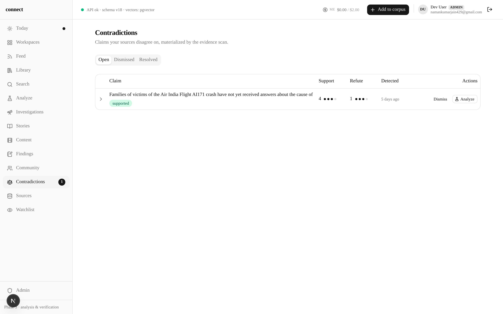
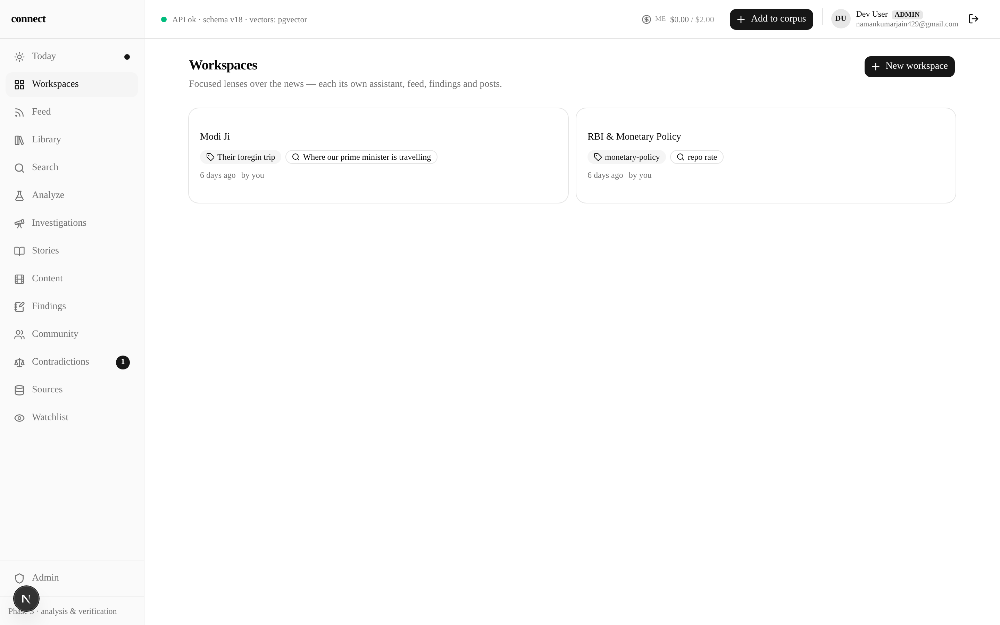
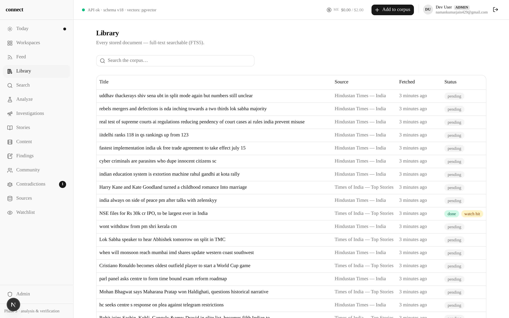

# connect — Information Intelligence System

`connect` is a single-user, local-first system for understanding Indian policy, politics
and finance, built on two first-class pillars. **Pillar A — Analysis (on-demand):** hand it
a claim, policy or event and it backtracks provenance to the primary source, verifies
against independent sources, maps driving forces, impacts and loopholes, and produces a
fully-cited dossier. **Pillar B — Knowledge base (continuous):** it polls a user-extensible
registry of sources around the clock (RBI, PIB, fact-checkers, national media, …) and
accumulates structured knowledge — entities, events, story threads, claims, contradictions
— so every analysis starts from, and writes back to, an evolving picture of what is going
on. Trust is the product: every assertion cites a stored immutable document snapshot, and
the citation discipline is enforced mechanically, not by prompt-hoping.

## Screenshots

| Feed — live corpus, pipeline-transparency view | Content Studio — grounded posts & reels |
|---|---|
|  |  |
| **Sources** — extensible registry, poll health | **Stories** — clustered story threads |
|  |  |
| **Investigations** — on-demand analyses | **Contradictions** — cross-source claim conflicts |
|  |  |
| **Workspaces** — conversational agent over the KB | **Library** — immutable document snapshots |
|  |  |

## Deployment (Docker Compose — v0.2)

The v0.2 runtime is six containers on one box, VPS-ready (design:
`docs/design/v02-runtime-deploy.md`): **Caddy** (TLS + path routing: `/api/*` → backend,
everything else → frontend), **api** (uvicorn ×2 — enqueues and streams, never executes
jobs), **worker** ×N (Postgres SKIP LOCKED queue; the beat scheduler runs *inside* the
workers, exactly one leader via advisory lock — there is no separate beat container),
**postgres** (pgvector/pg17), a one-shot **migrate** service that gates api/worker
startup, and an optional **backup** sidecar (prod profile).

```bash
cp .env.example .env       # set POSTGRES_PASSWORD; add API keys when you have them
docker compose up -d --build
docker compose ps          # wait for api/worker healthchecks to go healthy
```

The backend image bakes the fastembed model at build time — containers never download
it at startup. Schema creation/migration happens exactly once per `up` (the `migrate`
one-shot; advisory-locked, so racing starts are safe).

**Ports.** Host ports are parameterized so the stack coexists with whatever already
runs on the machine. Defaults: `http://localhost:8080` and `https://localhost:8443`
(self-signed — Caddy's internal CA for `localhost`; browse to the **https** port
directly, the http→https redirect targets the in-container :443). Dockerized Postgres
is published loopback-only on `127.0.0.1:55433` for the no-docker dev flow.

**VPS / real domain.** Set in `.env`:

```
CONNECT_DOMAIN=connect.example.com
CONNECT_HTTP_PORT=80
CONNECT_HTTPS_PORT=443
```

Same compose file; Caddy provisions Let's Encrypt automatically (ports 80/443 must be
reachable for issuance). That is the entire TLS story.

**Operations.**

```bash
docker compose up -d --scale worker=3        # more background throughput
docker compose --profile prod up -d          # adds the backup sidecar
docker compose logs -f worker                # job execution + beat ticks
```

The backup sidecar (prod profile) runs `pg_dump -Fc` nightly at 02:30 UTC and hardlink
blob snapshots (`rsync --link-dest`) at 03:00 UTC into the `backups` volume, with
7-daily + 4-weekly retention (`ops/backup/`). Content-addressed blobs never mutate, so
snapshots are near-free. On a VPS, point the `backups` volume at a separate disk and/or
rsync it offsite — that step is documented, not automated. Restore: `pg_restore -d
connect connect-YYYYMMDD.dump` plus copying a blob snapshot back into the `blobs`
volume.

## Local dev WITHOUT Docker (kept working)

Only Postgres runs in Docker; everything else is the familiar flow:

```bash
docker compose up -d postgres        # publishes 127.0.0.1:55433

cd backend
python -m venv .venv && .venv/bin/pip install -e ".[dev]"
export CONNECT_DATABASE_URL=postgresql://connect:<password>@127.0.0.1:55433/connect
.venv/bin/uvicorn connect.api.main:app --port 8001    # api (embedded queue for dev)
.venv/bin/python -m connect.workers.main               # one worker incl. beat

cd ../frontend
npm install && npm run dev           # http://localhost:3000, rewrite → localhost:8001
```

The `next dev` rewrite proxies `/api/*` to `BACKEND_URL` (default `http://localhost:8001`)
— dev-only; in production Caddy routes `/api/*` before Next ever sees it.

Tests run against an ephemeral tmpfs Postgres (never your dev database):

```bash
docker compose -f docker-compose.test.yml up -d db-test   # 127.0.0.1:55432
cd backend && .venv/bin/python -m pytest -q
```

On first boot the backend migrates the schema and seeds the India source registry
(RBI / PIB / Alt News / BOOM Live / ET / LiveMint / Scroll / Google News / X / Telegram);
workers poll sources and embed every ingested document locally (fastembed BGE-small).

## Authentication (v0.2 Phase B)

The whole `/api` surface sits behind cookie auth (server-side sessions in Postgres;
opaque `connect_session` httpOnly cookie; `/api/health` and `/api/auth/*` are the only
open routes). Sign-in is Google OAuth (authlib code flow) with an **invite gate**: the
first user to ever sign in becomes the admin; everyone after that must be invited by an
admin (`POST /api/admin/invites`) or listed in `CONNECT_ADMIN_EMAILS`. Uninvited Google
identities get a friendly "ask the admin for an invite" page and no account. Private
work stays private — admins manage users, not content.

### Google Cloud Console setup (one time)

1. Open <https://console.cloud.google.com/> → create (or pick) a project.
2. **APIs & Services → OAuth consent screen** (*Google Auth Platform → Branding*):
   set the app name + support email. Audience **External** is fine; while the app is
   in *Testing* you must add each Google account under **Test users** (or publish the
   app — no verification is needed for plain `openid email profile` scopes).
3. **APIs & Services → Credentials → Create credentials → OAuth client ID** →
   Application type **Web application**.
4. Under **Authorized redirect URIs** add the callback for every way you serve the API
   (the URI must match *exactly*, scheme + host + port + path):
   - Docker/Caddy on this machine: `https://localhost:8443/api/auth/callback`
   - VPS with a real domain: `https://connect.example.com/api/auth/callback`
   - Split-port local dev (uvicorn on :8001): `http://localhost:8001/api/auth/callback`
   (No "Authorized JavaScript origins" needed — this is a server-side code flow.)
5. Copy the client ID + secret into `.env` (compose) or `backend/.env` (no-docker dev):

   ```
   GOOGLE_OAUTH_CLIENT_ID=...apps.googleusercontent.com
   GOOGLE_OAUTH_CLIENT_SECRET=...
   CONNECT_SESSION_SECRET=<python3 -c "import secrets; print(secrets.token_urlsafe(32))">
   ```

Behind Caddy the callback URL is derived from the request automatically (uvicorn runs
`--proxy-headers`). In **split-port dev** (frontend `:3000` proxying to api `:8001`)
also set, in `backend/.env`:

```
CONNECT_OAUTH_REDIRECT_URI=http://localhost:8001/api/auth/callback   # what you registered
CONNECT_FRONTEND_ORIGIN=http://localhost:3000                        # land back on Next
```

Cookies are host-scoped (ports don't matter), so a callback on `localhost:8001` signs
you in for `localhost:3000` too.

### Dev login (no Google credentials yet)

Until OAuth credentials exist the system stays fully usable via an **env-gated dev
hatch**: set `CONNECT_DEV_LOGIN_EMAIL=dev@example.com` and the signin page grows a
"Continue as dev@example.com" button (`POST /api/auth/dev-login`) that creates/signs in
exactly that user — first user ever still becomes admin. The endpoint takes no input
and refuses to exist (404) when the variable is unset. **Dev-only: never set it on a
production deployment** — it is plaintext sign-in as whoever controls the env.

CSRF posture: `SameSite=Lax` cookies plus an Origin-check middleware on state-changing
methods; the allowlist for the dev rewrite's cross-port Origin is
`CONNECT_ALLOWED_ORIGINS` (defaults cover `localhost:3000`).

### Environment variables

`.env.example` documents every deployment knob — database DSN, domain/ports, provider
keys (`ANTHROPIC_API_KEY`, `TAVILY_API_KEY`, `TWITTERAPI_IO_API_KEY`) and the LLM
budget envelope: per-day general/investigation budgets, member defaults (seeded into
the admin-editable `app_setting` table), and `CONNECT_GLOBAL_DAILY_BUDGET_USD` — the
deployment-wide backstop that caps the actual API bill. The full list with defaults
lives in `backend/connect/orchestration/config.py` (env prefix `CONNECT_`); commonly
toggled in dev: `CONNECT_POLLER_ENABLED=false`, `CONNECT_EMBEDDINGS_ENABLED=false`.

## Budgets, limits & admin (v0.2 Phase D)

Every LLM call is ledgered with the acting user (`llm_call.user_id`; jobs carry
`job.owner_id` and the worker attributes all spend inside a job to its owner —
system work stays unattributed). Three budget layers gate every call, checked
in order: the **global backstop** (`global_daily_budget_usd`, locked $10/day —
the cap on the actual API bill), the **purpose envelope** (general vs
investigation, the v0.1 governors), and the **per-user ceiling** (admin-set
override on the user, else the member defaults — $0.50 general / $2.00
investigation; admins get the whole envelope). All five budget values live in
the admin-editable `app_setting` table (env values are first-boot seeds) and
are read per check — admin changes apply immediately, no restart.

Over-limit requests get a friendly `429` with the remaining budget. Two more
backpressure valves: per-user in-flight interactive jobs
(`CONNECT_USER_MAX_INTERACTIVE`, default 2) + global interactive queue depth
(`CONNECT_INTERACTIVE_QUEUE_LIMIT`), and per-user request rate limits
(120/min reads, 10/min ingest, 5/min analysis/investigation creation;
in-memory, SSE exempt).

Admin surface (all `require_admin`): `GET/PATCH /api/admin/users[/{id}]`
(role, disable — revokes sessions instantly —, budget overrides; explicit
`null` clears an override), `GET/POST/DELETE /api/admin/invites`,
`GET/PATCH /api/admin/settings` (the five budget globals),
`GET /api/admin/spend` (system totals + per-user/day breakdown), and
`GET /api/metrics` (Prometheus text). `GET /api/spend` now returns "my spend"
(`mine`: effective caps + my ledger) alongside the global context; `GET
/api/health?deep=1` adds queue depth, beat liveness, poll staleness, blob
writability and budget state (open endpoint — numbers only, never secrets).

## Phase status

| Phase | Scope | Status |
|---|---|---|
| 0 | Corpus skeleton + T0 (no LLM): full schema, blob store, ingestion (URL/file/paste + RSS poller), simhash dedup, FTS5, fastembed + sqlite-vec, watches + deterministic matching, source registry CRUD + India seeds, `/feed` + `/library` + ingest UI | **Done** |
| 1 | KB alive (first LLM): provider ABC + Anthropic tiers, spend ledger + $2/day governor, Batch runner, T1 nightly enrichment + watch fast-path, entity mentions + aliases, `/entity/[id]`, `/watchlist` badges, `/search`, `/sources` UI | Planned |
| 2 | Events, threads, Brief: T2 promotion, event clustering + audit, story threading, thread pages, Today brief, calendar seed, view-cursor deltas | Planned |
| 3 | Verification + contradictions: claim decomposition, stance → deterministic verdicts, Tavily SearchClient, contradiction ledger, verdict history, minimal dossier + SSE | Planned |
| 4 | Provenance + deep sources + Ask: provenance tool loop, PRS + Indian Kanoon adapters, ProvenanceTimeline, hybrid RRF search, Ask-the-KB | Planned |
| 5 | Graph deepening + interpretation: grade-2 writeback, edge bitemporality, forces/impacts stages grounded by the accumulated graph | Planned |
| 6 | Loopholes, explorer, patterns, polish: loophole stage + cards, full narrative + citation verifier, `/graph` explorer, pattern dashboards, source quality scores, OllamaProvider | Planned |

The full design lives in the v0.1 plan (two pillars, tiered enrichment ladder, grounding
discipline, data model). Each phase ends runnable; the knowledge base accretes from day one.
